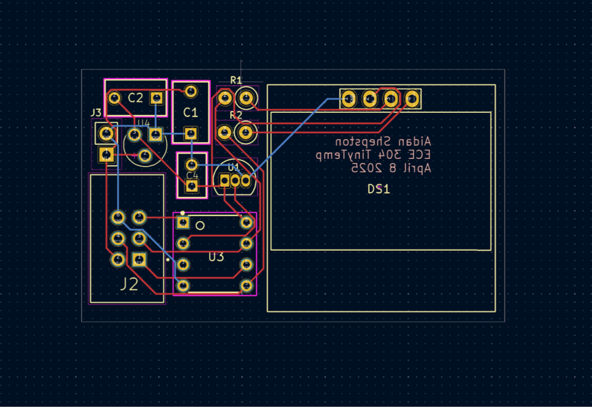

# About Me

Highly motivated and passionate CS and ECE student looking for an internship. Able to adapt to new situations quickly and learn
new tools and concepts. Eager to get real-world experience in a group setting and apply technical skills and knowledge.

---

# Projects

## Sorting and Graph Traversal Visualizer

<video width="600" controls>
  <source src="videos/demo.mp4" type="video/mp4">
  Your browser does not support the video tag.
</video>

**Tech**: Vue, Typescript
**Link**: [Github Repo](https://github.com/atshepston/Data-Visualization-App)

This project focued on solving a problem that myself and a lot of my fellow students 
had when learning about algorithms: understanding what they _looked_ like. In order to 
solve this issue, I built this tool with a group in order to visualize what common 
array sorting techniques visually looked like, as well as what paths common traversal algorithms
took on an arbitrary graph. 

---

## Local Face Recognition on a Raspberry Pi

**Tech**: Python, Tensorflow
**Link**: [Github Repo](https://github.com/atshepston/ECE535-Smart-Doorbell)

Smart doorbells can sometimes depend heavily on cloud infrastructure, which can introduce latency, privacy concerns, and higher costs. By deploying ML systems on a Raspberry Pi in real-world settings we can achieve real-time detection, address privacy concerns and, and lower costs.

---

## ServiceSignal

**Tech**: Python, FastAPI, Postgres, Docker
**Link**: [Github Repo](https://github.com/atshepston/ServiceSignal)

ServiceSignal is a app aimed at making keeping track of vehicle maintenance easier. Once you input your vehicle and service records, ServiceSignal will alert you when regular maintenance is needed, for any common replacable.

---

## TinyTemp

<video width="600" controls>
  <source src="videos/tinyTempDemo.mp4" type="video/mp4">
  Your browser does not support the video tag.
</video>

**Tech**: C, PCB Design

Designed and built a miniaturized temperature-sensing device powered by an ATtiny85 microcontroller, including a custom PCB optimized for strict size and power constraints. Developed ultra-low-power embedded firmware in C using duty-cycling and watchdog timers to extend battery life. Added a clear, user-friendly OLED interface with selectable °F/°C readout.
